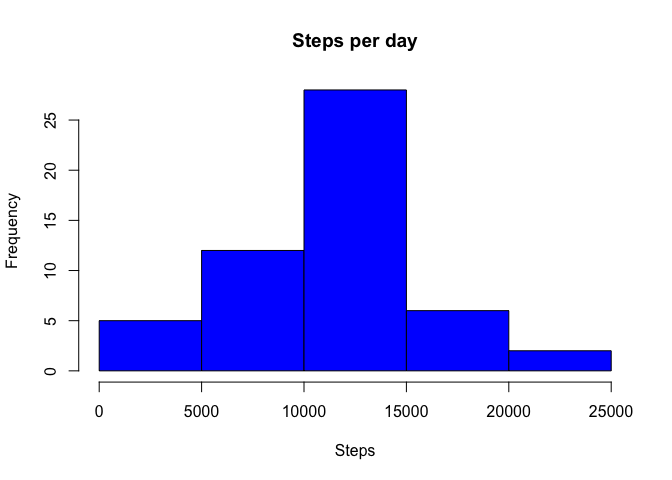
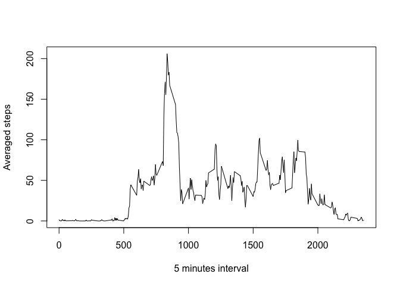
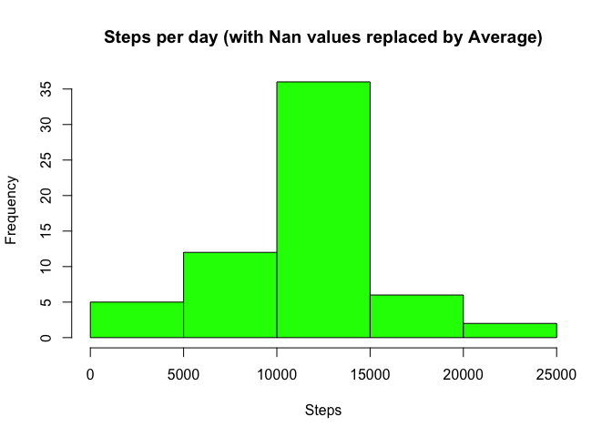
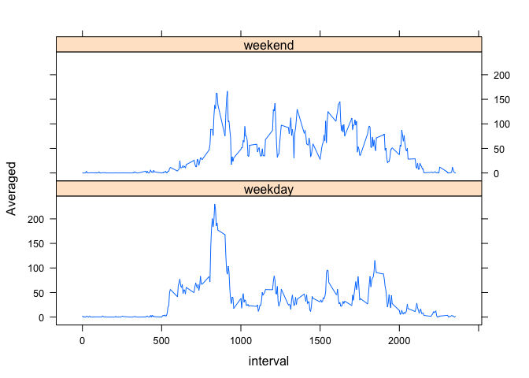

# Reproducible Research: Peer Assessment 1


## Loading and preprocessing the data

```r
act <- read.table("activity.csv", sep=",",header=TRUE)
act[,"date"] <- as.Date(act[,"date"],"%Y-%m-%d")
```

## What is mean total number of steps taken per day?
Ignoring the missing values in the dataset:

```r
dat <-act[complete.cases(act),]
```
Calculating the total number of steps taken per day and generating the histogram:

```r
library(plyr)
dat2 <- ddply(dat, .(date), transform, MaxSteps = max(cumsum(steps)))
dat2 <- ddply(dat2,c("date","MaxSteps"),head,1)

hist(dat2$MaxSteps, main="Steps per day", xlab="Steps", col="blue")
```

 
  
Mean and median of total number of steps taken per day:

```r
print(mean(dat2$MaxSteps))
```

```
## [1] 10766.19
```

```r
print(median(dat2$MaxSteps))
```

```
## [1] 10765
```

## What is the average daily activity pattern?

Time series plot of the 5-minute interval (x-axis) and the average number of steps taken, averaged across all days (y-axis):


```r
dat3 <- ddply(dat, .(interval), transform, Averaged = mean(steps))
dat3 <- ddply(dat3,c("interval","Averaged"),head,1)
plot(dat3$interval,dat3$Averaged, type="l", 
     xlab = "5 minutes interval", ylab="Averaged steps")
```

 

5-minute interval, on average across all the days in the dataset, containing the maximum number of steps:


```r
print(dat3[which.max(dat3$Averaged),"interval"])
```

```
## [1] 835
```

## Imputing missing values
Total number of missing values in the dataset (i.e. the total number of rows with NAs)

```r
print(sum(is.na(act$steps)))
```

```
## [1] 2304
```

Filling in all of the missing values in a new dataset (dat4) with the mean for the corresponding 5-minute interval.

```r
dat4 <- ddply(act, .(interval), transform, Averaged = mean(steps, na.rm=TRUE))
dat4$steps[is.na(dat4$steps)] <- dat4$Averaged[is.na(dat4$steps)]
```

Histogram of the total number of steps taken each day: 

```r
dat5 <- ddply(dat4, .(date), transform, MaxSteps = max(cumsum(steps)))
dat5 <- ddply(dat5,c("date","MaxSteps"),head,1)
hist(dat5$MaxSteps, main="Steps per day (with Nan values replaced by Average)",
     xlab="Steps", col="green")
```

 

Mean and median total number of steps taken per day:

```r
print(mean(dat5$MaxSteps))
```

```
## [1] 10766.19
```

```r
print(median(dat5$MaxSteps))
```

```
## [1] 10766.19
```

Although the mean remains equal to the first part of the assignment, the median has changed and become equal to the mean. Inputing missing data increases the frequency of days with greater number of steps.

## Are there differences in activity patterns between weekdays and weekends?
Using the dataset with the filled-in missing values (dat4), a new factor variable in the dataset with two levels – “weekday” and “weekend” indicating whether a given date is a weekday or weekend day, is being created.


```r
wd <- c('Monday', 'Tuesday', 'Wednesday', 'Thursday', 'Friday')
dat4$wDay <- c("weekend","weekday")[(weekdays(dat4$date) %in% wd)+1L]
dat4 <- ddply(dat4, .(interval,wDay), transform, Averaged = mean(steps, na.rm=TRUE))
dat4 <- ddply(dat4,c("interval","wDay","Averaged"),head,1)
```

Time series plot of the 5-minute interval (x-axis) and the average number of steps taken, averaged across all weekday days or weekend days (y-axis). 


```r
library(lattice)
print(xyplot(Averaged ~ interval | wDay, data = dat4, layout = c(1,2),type="l"))
```

 

